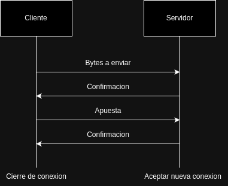
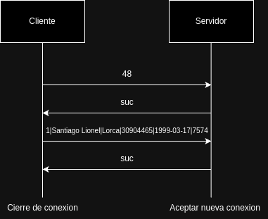

# TP0: Docker + Comunicaciones + Concurrencia

En el presente repositorio se provee un ejemplo de cliente-servidor el cual corre en containers con la ayuda de [docker-compose](https://docs.docker.com/compose/). El mismo es un ejemplo práctico brindado por la cátedra para que los alumnos tengan un esqueleto básico de cómo armar un proyecto de cero en donde todas las dependencias del mismo se encuentren encapsuladas en containers. El cliente (Golang) y el servidor (Python) fueron desarrollados en diferentes lenguajes simplemente para mostrar cómo dos lenguajes de programación pueden convivir en el mismo proyecto con la ayuda de containers.

Por otro lado, se presenta una guía de ejercicios que los alumnos deberán resolver teniendo en cuenta las consideraciones generales descriptas al pie de este archivo.

## Instrucciones de uso
El repositorio cuenta con un **Makefile** que posee encapsulado diferentes comandos utilizados recurrentemente en el proyecto en forma de targets. Los targets se ejecutan mediante la invocación de:

* **make \<target\>**:
Los target imprescindibles para iniciar y detener el sistema son **docker-compose-up** y **docker-compose-down**, siendo los restantes targets de utilidad para el proceso de _debugging_ y _troubleshooting_.

Los targets disponibles son:
* **docker-compose-up**: Inicializa el ambiente de desarrollo (buildear docker images del servidor y cliente, inicializar la red a utilizar por docker, etc.) y arranca los containers de las aplicaciones que componen el proyecto.
* **docker-compose-down**: Realiza un `docker-compose stop` para detener los containers asociados al compose y luego realiza un `docker-compose down` para destruir todos los recursos asociados al proyecto que fueron inicializados. Se recomienda ejecutar este comando al finalizar cada ejecución para evitar que el disco de la máquina host se llene.
* **docker-compose-logs**: Permite ver los logs actuales del proyecto. Acompañar con `grep` para lograr ver mensajes de una aplicación específica dentro del compose.
* **docker-image**: Buildea las imágenes a ser utilizadas tanto en el servidor como en el cliente. Este target es utilizado por **docker-compose-up**, por lo cual se lo puede utilizar para testear nuevos cambios en las imágenes antes de arrancar el proyecto.
* **build**: Compila la aplicación cliente para ejecución en el _host_ en lugar de en docker. La compilación de esta forma es mucho más rápida pero requiere tener el entorno de Golang instalado en la máquina _host_.
* **netcat**: Buildea la imagen de `netcat` y ejecuta el container.


### Servidor
El servidor representa una central de Loteria Nacional: recibe apuestas de distintas agencias y realiza un sorteo. El servidor actual funciona de la sigueinte forma:
1. Servidor acepta una nueva conexion
2. Servidor recibe mensaje del cliente, que contiene la longitud del batch de apuestas a realizar y procede a responder con `suc` si se recibio correctamente
3. Servidor recibe otro mensaje del cliente, esta vez conteniendo el batch de apuestas, la almacena en el archivo `bets.csv` y responde `suc`
4. Servidor desconecta al cliente
5. Servidor procede a recibir una conexion nuevamente


### Cliente
El cliente representa una agencia de apuestas y envia mensajes de la siguiente forma.
1. Cliente se conecta al servidor
2. Cliente lee archivo de apuestas
3. Cliente lee una cantidad de bytes establecida por la configuracion `max_batch_size`
4. Cliente envia la longitud del batch de apuestas a enviar.
Recibe confirmacion del servidor
5. Cliente envia el batch de apuestas.
Recibe la confirmacion del servidor
6. Vuelve a paso 3 hasta que no hayan mas bytes para leer en el archivo
7. Cliente cierra conexion
8. Finaliza ejecucion

### Protocolo
El mensaje enviado del cliente al servidor esta conformado por
`{agencia}|{nombre}|{apellido}|{documento}|{fecha de nacimiento}|{numero}`

* `Agencia`: Un numero entero de cualquier tamaño
* `Nombre`: Una cadena de tamaño variable
* `Apellido`: Una cadena de tamaño variable
* `Documento`: una numero de 8 digitos
* `Fecha de nacimiento`: Una cadena que indica la fecha en el formato YYYY-MM-DD
* `Numero`: Una numero de 4 digitos que representa el numero a apostar

Flujo general:



Ejemplo de flujo para la siguiente apuesta:

* Agencia: 1
* Nombre: Santiago Lionel
* Apellido: Lorca
* Documento: 30904465
* Fecha de nacimiento: 1999-03-17
* Numero: 7574



#### Soporte para batches
Para permitir que las agencias puedan mandar mas de una apuesta en una misma consulta, se utilizo el caracter `;` para unir multiples apuestas en el mismo mensaje.

El tamaño del batch es configurable a traves de la variable de entorno `max_batch_size`. La cantidad de apuestas que se mandan es variable, dependiendo de la longitud de los campos que compone cada apuesta.

Ejemplo:

```
1|Santiago Lionel|Lorca|30904465|1999-03-17|2201;1|Agustin Emanuel|Zambrano|21689196|2000-05-10|9325;1|Tiago Nicolás|Rivera|34407251|2001-08-29|1033;1|Camila Rocio|Varela|37130775|1995-05-09|4179
```

Esto se descompone en las apuestas
```
1|Santiago Lionel|Lorca|30904465|1999-03-17|2201
1|Agustin Emanuel|Zambrano|21689196|2000-05-10|9325
1|Tiago Nicolás|Rivera|34407251|2001-08-29|1033
1|Camila Rocio|Varela|37130775|1995-05-09|4179
```


Al ejecutar el comando `make docker-compose-up` para comenzar la ejecución del ejemplo y luego el comando `make docker-compose-logs`, se observan los siguientes logs:

```
$ make docker-compose-logs
docker compose -f docker-compose-dev.yaml logs -f
client1  | time="2024-03-24 22:56:35" level=error msg="action: receive_confirm_message | result: sucess | client_id: 1"
client1  | time="2024-03-24 22:56:35" level=error msg="action: receive_confirm_message | result: sucess | client_id: 1"
client1  | time="2024-03-24 22:56:35" level=info msg="action: apuesta_enviada | result: success | dni: 30904465 | numero: 7574"
server   | 2024-03-24 22:56:35 DEBUG    action: config | result: success | port: 12345 | listen_backlog: 5 | logging_level: DEBUG
server   | 2024-03-24 22:56:35 INFO     action: accept_connections | result: in_progress
server   | 2024-03-24 22:56:35 INFO     action: accept_connections | result: success | ip: 172.25.125.3
server   | 2024-03-24 22:56:35 INFO     action: receive_message_length | result: success | length: 48
server   | 2024-03-24 22:56:35 INFO     action: send sucess message | result: success
server   | 2024-03-24 22:56:35 INFO     action: receive_message | result: success | ip: 172.25.125.3 | msg: b'1|Santiago Lionel|Lorca|30904465|1999-03-17|7574'
server   | 2024-03-24 22:56:35 INFO     action: apuesta_almacenada | result: success | dni: 30904465 | numero: 7574.
server   | 2024-03-24 22:56:35 INFO     action: send sucess message | result: success
server   | 2024-03-24 22:56:35 INFO     action: closing client socket | result: in_progress
server   | 2024-03-24 22:56:35 INFO     action: closing client socket | result: success
server   | 2024-03-24 22:56:35 INFO     action: accept_connections | result: in_progress
```

### Creacion de docker-compose
`python3 create-compose.py <n>`

Crea un nuevo archivo de docker-compose con n clientes, si se deja vacio se crea con 1 solo cliente

### Netcat
El script `netcat` se conecta al servidor una sola vez, envia el mensaje "Hola Mundo" e imprime "Servidor repondio correctamente" si el servidor responde con el mismo mensaje enviado.

## Parte 1: Introducción a Docker
En esta primera parte del trabajo práctico se plantean una serie de ejercicios que sirven para introducir las herramientas básicas de Docker que se utilizarán a lo largo de la materia. El entendimiento de las mismas será crucial para el desarrollo de los próximos TPs.

### Ejercicio N°1:
Modificar la definición del DockerCompose para agregar un nuevo cliente al proyecto.

### Ejercicio N°1.1:
Definir un script (en el lenguaje deseado) que permita crear una definición de DockerCompose con una cantidad configurable de clientes.

### Ejercicio N°2:
Modificar el cliente y el servidor para lograr que realizar cambios en el archivo de configuración no requiera un nuevo build de las imágenes de Docker para que los mismos sean efectivos. La configuración a través del archivo correspondiente (`config.ini` y `config.yaml`, dependiendo de la aplicación) debe ser inyectada en el container y persistida afuera de la imagen (hint: `docker volumes`).

### Ejercicio N°3:
Crear un script que permita verificar el correcto funcionamiento del servidor utilizando el comando `netcat` para interactuar con el mismo. Dado que el servidor es un EchoServer, se debe enviar un mensaje al servidor y esperar recibir el mismo mensaje enviado. Netcat no debe ser instalado en la máquina _host_ y no se puede exponer puertos del servidor para realizar la comunicación (hint: `docker network`).

### Ejercicio N°4:
Modificar servidor y cliente para que ambos sistemas terminen de forma _graceful_ al recibir la signal SIGTERM. Terminar la aplicación de forma _graceful_ implica que todos los _file descriptors_ (entre los que se encuentran archivos, sockets, threads y procesos) deben cerrarse correctamente antes que el thread de la aplicación principal muera. Loguear mensajes en el cierre de cada recurso (hint: Verificar que hace el flag `-t` utilizado en el comando `docker compose down`).

## Parte 2: Repaso de Comunicaciones

Las secciones de repaso del trabajo práctico plantean un caso de uso denominado **Lotería Nacional**. Para la resolución de las mismas deberá utilizarse como base al código fuente provisto en la primera parte, con las modificaciones agregadas en el ejercicio 4.

### Ejercicio N°5:
Modificar la lógica de negocio tanto de los clientes como del servidor para nuestro nuevo caso de uso.

#### Cliente
Emulará a una _agencia de quiniela_ que participa del proyecto. Existen 5 agencias. Deberán recibir como variables de entorno los campos que representan la apuesta de una persona: nombre, apellido, DNI, nacimiento, numero apostado (en adelante 'número'). Ej.: `NOMBRE=Santiago Lionel`, `APELLIDO=Lorca`, `DOCUMENTO=30904465`, `NACIMIENTO=1999-03-17` y `NUMERO=7574` respectivamente.

Los campos deben enviarse al servidor para dejar registro de la apuesta. Al recibir la confirmación del servidor se debe imprimir por log: `action: apuesta_enviada | result: success | dni: ${DNI} | numero: ${NUMERO}`.

#### Servidor
Emulará a la _central de Lotería Nacional_. Deberá recibir los campos de la cada apuesta desde los clientes y almacenar la información mediante la función `store_bet(...)` para control futuro de ganadores. La función `store_bet(...)` es provista por la cátedra y no podrá ser modificada por el alumno.
Al persistir se debe imprimir por log: `action: apuesta_almacenada | result: success | dni: ${DNI} | numero: ${NUMERO}`.

#### Comunicación:
Se deberá implementar un módulo de comunicación entre el cliente y el servidor donde se maneje el envío y la recepción de los paquetes, el cual se espera que contemple:
* Definición de un protocolo para el envío de los mensajes.
* Serialización de los datos.
* Correcta separación de responsabilidades entre modelo de dominio y capa de comunicación.
* Correcto empleo de sockets, incluyendo manejo de errores y evitando los fenómenos conocidos como [_short read y short write_](https://cs61.seas.harvard.edu/site/2018/FileDescriptors/).

### Ejercicio N°6:
Modificar los clientes para que envíen varias apuestas a la vez (modalidad conocida como procesamiento por _chunks_ o _batchs_). La información de cada agencia será simulada por la ingesta de su archivo numerado correspondiente, provisto por la cátedra dentro de `.data/datasets.zip`.
Los _batchs_ permiten que el cliente registre varias apuestas en una misma consulta, acortando tiempos de transmisión y procesamiento. La cantidad de apuestas dentro de cada _batch_ debe ser configurable. Realizar una implementación genérica, pero elegir un valor por defecto de modo tal que los paquetes no excedan los 8kB. El servidor, por otro lado, deberá responder con éxito solamente si todas las apuestas del _batch_ fueron procesadas correctamente.

### Ejercicio N°7:
Modificar los clientes para que notifiquen al servidor al finalizar con el envío de todas las apuestas y así proceder con el sorteo.
Inmediatamente después de la notificacion, los clientes consultarán la lista de ganadores del sorteo correspondientes a su agencia.
Una vez el cliente obtenga los resultados, deberá imprimir por log: `action: consulta_ganadores | result: success | cant_ganadores: ${CANT}`.

El servidor deberá esperar la notificación de las 5 agencias para considerar que se realizó el sorteo e imprimir por log: `action: sorteo | result: success`.
Luego de este evento, podrá verificar cada apuesta con las funciones `load_bets(...)` y `has_won(...)` y retornar los DNI de los ganadores de la agencia en cuestión. Antes del sorteo, no podrá responder consultas por la lista de ganadores.
Las funciones `load_bets(...)` y `has_won(...)` son provistas por la cátedra y no podrán ser modificadas por el alumno.

## Parte 3: Repaso de Concurrencia

### Ejercicio N°8:
Modificar el servidor para que permita aceptar conexiones y procesar mensajes en paralelo.
En este ejercicio es importante considerar los mecanismos de sincronización a utilizar para el correcto funcionamiento de la persistencia.

En caso de que el alumno implemente el servidor Python utilizando _multithreading_,  deberán tenerse en cuenta las [limitaciones propias del lenguaje](https://wiki.python.org/moin/GlobalInterpreterLock).

## Consideraciones Generales
Se espera que los alumnos realicen un _fork_ del presente repositorio para el desarrollo de los ejercicios.
El _fork_ deberá contar con una sección de README que indique como ejecutar cada ejercicio.
La Parte 2 requiere una sección donde se explique el protocolo de comunicación implementado.
La Parte 3 requiere una sección que expliquen los mecanismos de sincronización utilizados.

Finalmente, se pide a los alumnos leer atentamente y **tener en cuenta** los criterios de corrección provistos [en el campus](https://campusgrado.fi.uba.ar/mod/page/view.php?id=73393).
